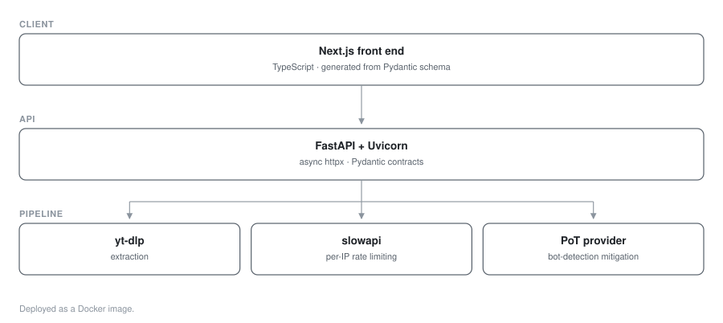

# VidSnappy — Video Downloader Service

**Video service · FastAPI + Next.js · Dockerised**

A multi-platform video downloader built for throughput and abuse resistance — async Python extraction behind a typed Next.js front end.

> **Source code is private.** This repository documents the architecture and engineering work.

## My role
Full-stack engineer

## Architecture

| Service | Stack |
|---|---|
| Extraction API | Python, FastAPI, Uvicorn, yt-dlp |
| Front end | Next.js, React, TypeScript |
| Deploy | Docker |

### Service topology

## Engineering highlights

**Async extraction.** FastAPI with `httpx` for fully async metadata and stream resolution — extraction is IO-bound, so async concurrency handles many simultaneous requests on modest hardware.

**Abuse resistance.** `slowapi` enforces per-IP rate limiting at the edge of the API, which is the main operational concern for a public downloader.

**Bot-detection mitigation.** `bgutil-ytdlp-pot-provider` supplies proof-of-origin tokens to keep extraction working against platform anti-automation measures — the part of this problem that actually breaks in production.

**Typed contracts.** Pydantic models validate every request and response, giving the TypeScript front end a stable schema to generate against.

**Containerised.** Dockerfile-based deployment with environment-driven configuration.

## Stack

`FastAPI` · `Python` · `yt-dlp` · `Next.js` · `TypeScript` · `React` · `Docker`
